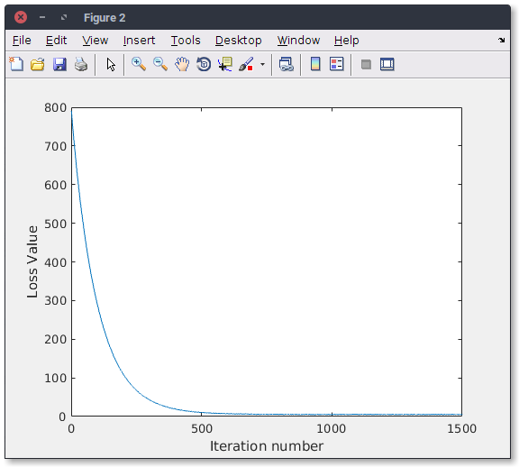
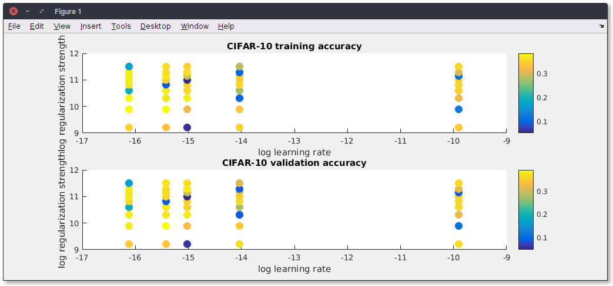
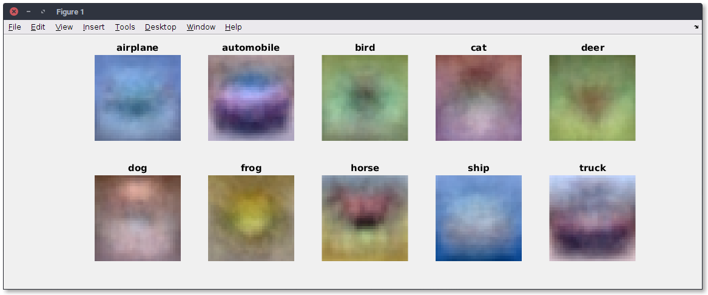

\clearpage

# Introduction

Le présent rapport rend compte de nos travaux lors des séances de Bureau d'Étude et suit le cheminement des énoncés [@BE].

Une première partie de ce rapport concerne la programmation d'un classifieur KNN. Une seconde partie concerne l'apprentissage d'un algorithme SVM. Une troisième partie concerne l'implémentation d'un classifieur de type Softmax. Une quatrième partie concerne la programmation d'un alogorithme de type réseau de neuronnes à deux couches. Enfin, une cinquième partie concerne l'implémentation de l'exemple simple de *QLearning* du dernier BE [@QL].

*NB: Ce Bureau d'étude est réalisé sous le logiciel `Matlab`.*

\noindent
Mots-clés: *kNN, Support Vector Machine, Softmax, Réseau de neuronnes, Images features, QLearning.*


-----

# KNN

## Knn_compute_distances_two_loops.m

Dans cette partie on commence par implémenter le code qui mesure la matrice distance entre tout les training et les tests exemples.Par exemple si on a Ntr training exemples et Nte exemples test on obtient une matrice de taille Nte*Ntr ou chaque élément (i,j) est la distance entre le i ème test et le j ème train et ceci via un double boucle for.

Ceci est le code :
\lstinputlisting{../assets/classifier/knn/knn_compute_distances_two_loops.m}

Aprés l'exécution on obtient une matrice de taille 500 * 5000:

Imprime écran

## Knn_predict_labes.m

On a implémenté ici la fonction qui prédit le label de chaque exemple test.

En prenant la matrice dists on trie cette matrice aprés on prend les k plus proches labels aprés en utilisant la fonction mod on obtient le label le plus commun càd le label qui se répéte le plus .

Ceci est le code:
\lstinputlisting{../assets/classifier/knn/knn_predict_labels.m}

Le résultat obtenu aprés l'éxécution de cette partie est le suivant avec une accuracy de 0.274000

Imprime écran

## Now lets try out a larger k, say k=5

Dans cette partie on a utilisé un k=5 et on a effectué le test pour obtenir une accuracy égale à ...

Imprime écran

-----

# SVM

## `svm_loss_naive.m`

Nous implémentons dans un premier temps la fonction *loss* ainsi que le gradient dans le fichier `svm_loss_naive.m`

```
function [ loss, dW ] = svm_loss_naive( W, X, y, reg )

    dW = zeros(size(W));
    num_classes = size(W,1);
    num_train = size(X, 1);

    loss = 0.0;
    for i = 1:num_train
        scores = W*X(i, :)';
        correct_class_score = scores(y(i));
        for j = 1:num_classes
        if j == y(i)
            continue;
        end
        margin = scores(j) - correct_class_score + 1; % note delta = 1
        if margin > 0
            loss = loss + margin;
            %your code 
            dW(j,:) = dW(j,:) + X(i, :);
            dW(y(i),:) = dW(y(i),:) - X(i, :);
        end
        end
    end

    % Right now the loss is a sum over all training examples, but we want it
    % to be an average instead so we divide by num_train
    loss = loss/num_train;

    % Average gradients as well
    %your code 
    dW = dW/num_train;

    % Add regularization to the loss.
    loss = loss + 0.5 * reg * sum(sum((W.*W)));

    % Add regularization to the gradient
    % your code
    dW = dW + reg * W;

end
```

### Gradcheck

Ce code permet la comparaison du calcul du *loss* analitique et numérique :

```bash
numerical: -11.624341 analytic: -11.623547, relative error: 3.416353e-05
numerical: -2.967959 analytic: -2.968469, relative error: 8.596690e-05
numerical: 1.370071 analytic: 1.370463, relative error: 1.429105e-04
numerical: -34.207994 analytic: -34.207484, relative error: 7.450883e-06
numerical: 15.514664 analytic: 15.515966, relative error: 4.194596e-05
numerical: -0.409555 analytic: -0.408745, relative error: 9.892837e-04
numerical: 15.763268 analytic: 15.764060, relative error: 2.509722e-05
numerical: -25.588662 analytic: -25.588890, relative error: 4.470214e-06
numerical: -4.197175 analytic: -4.193180, relative error: 4.760962e-04
numerical: -9.371776 analytic: -9.370036, relative error: 9.280094e-05
```

Avec le terme de régularisation nous obetnons :

```bash
numerical: 16.210153 analytic: 16.211038, relative error: 2.730251e-05
numerical: -1.609398 analytic: -1.615602, relative error: 1.923819e-03
numerical: -17.736330 analytic: -17.721728, relative error: 4.118093e-04
numerical: -11.510254 analytic: -11.493891, relative error: 7.113270e-04
numerical: -6.772364 analytic: -6.775551, relative error: 2.352329e-04
numerical: 9.015804 analytic: 9.005720, relative error: 5.595433e-04
numerical: -8.930279 analytic: -8.915413, relative error: 8.330575e-04
numerical: 2.049767 analytic: 2.052767, relative error: 7.311906e-04
numerical: 27.281231 analytic: 27.279314, relative error: 3.513422e-05
numerical: 26.358994 analytic: 26.371298, relative error: 2.333422e-04
```


Les erreurs sont extrêmement faibles, nous supposons que l'implémentation est juste.

### Inline Question 1

**It is possible that once in a while a dimension in the gradcheck will not match exactly. What could such a discrepancy be caused by? Is it a reason for concern? What is a simple example in one dimension where a gradient check could fail? Hint: the SVM loss function is not strictly speaking differentiable.**

Le gradient n'est pas strictement différentiable. En considérant une dimension, un point peut avoir un gradient analytique nul et un gradient numérique positif par exemple. D'où la possibilité d'une erreur dans le *gradcheck* pour certaines dimensions de temps en temps. Ceci ne doit pas être préoccupant pour autant.

## `svm_loss_vectorized.m`

Nous implémentons la version vectorisée de l'aglorithme précédent :

### Loss

```
num_classes = size(W,1);

scores = W * X';
correct_indexes = (0:num_train-1)*num_classes+double(y');
correct_class_score = ones(num_classes,1)*scores(correct_indexes);
L = scores - correct_class_score + 1; % delta = 1

L(L<0) = 0;
loss = sum(sum(L))- 1*num_train; % On retire les Lyi comptés en trop
loss = loss/num_train;

% Regularization
loss = loss + 0.5 * reg * sum(sum((W.*W)));
```

### Gradient

```
L(L>0) = 1;
L(correct_indexes) = -sum(L);
dW=L*X;

dW = dW/num_train;
% Add regularization to the gradient
dW = dW + reg * W;

```

### Résultats

Nous obetnons les résultats suivant :

```bash
Naive loss: 9.150210e+00 computed in 38.956417s
Vectorized loss: 9.150210e+00 computed in 0.780730s
difference: -0.000000

Naive loss and gradient: computed in 36.895610s
Vectorized loss and gradient: computed in 0.480518s
difference: 291.412469
```

La différence est numériquement nulle : nous considérons que l'implémentation est correcte. Nous remarquons l'efficacité de la version vectorisée par rapport à la version analitique.

## Stochastic Gradient Descent

Nous implémentons le SGD dans le fichier `linear_svm_train.m`.

```
...
        rand_idx = randsample(num_train, batch_size);
        X_batch = X(rand_idx, :);
        y_batch = y(rand_idx);

        %evaluate loss and gradient
        [loss, grad] = self_loss(W, X_batch, y_batch, reg);
        loss_hist(it) = loss;
        
%perform parameter update
        W = W - learning_rate * grad;
...
```

Nous obtenons la descente suivante (cf. figure).



## `linear_svm_predict.m`

La fonction de prédiction s'écrit simplement de la manière suivante :

```
function [ y_pred ] = linear_svm_predict( model, X )
    y_pred = [];
        scores = model.W * X';
        [~,y_pred] = max(scores);
end
```

## Configuration des hyperparamètres dans le script `Run_svm.m`

Afin de choisir les meilleurs paramètres, nous créons une boucle testants l'ensemble des paramètres choisis :

```
iter_num = 1000;
%iter_num = 100;
for i = 1:length(learning_rates)
    learning = learning_rates(i);
    for j = 1:length(regularization_strengths)
        regularization = regularization_strengths(j);
        [model, loss_hist] = linear_svm_train(imdb.X_train, imdb.y_train, learning, regularization, iter_num);
        y_train_pred = linear_svm_predict(model, imdb.X_train);
        train_accuracy = mean(imdb.y_train == y_train_pred');
        fprintf('training accuracy: %f', train_accuracy); % (train_accuracy)
        y_val_pred = linear_svm_predict(model, imdb.X_val);
        val_accuracy = mean(imdb.y_val' == y_val_pred);
        fprintf('validation accuracy: %f', val_accuracy);  % (val_accuracy)
        
        if val_accuracy > best_val
            best_val = val_accuracy;
            best_svm = model;
        end
        
        results(i, j, :) = [train_accuracy, val_accuracy];
    end
end
```

Visualisation des expériences :




Les meilleurs résultats retournés sont : 

```bash
...
lr 1.000000e-07 reg 3.000000e+04 train accuracy: 0.379776 val accuracy: 0.390000
...
best validation accuracy achieved during cross-validation: 0.390000
linear SVM on raw pixels final test set accuracy: 0.382000
```

## Visualisation des résultats

Voici les matrices images résultantes de l'apprentissage de l'algorithme pour chacune des classes d'images :


### Inline Question 2

**Describe what your visualized SVM weights look like, and offer a brief explanation for why they look they way that they do.**

Ces matrices images sont les représentations de chaque classe pour la SVM. Elles sont très distinctes en termes de couleurs par rapport à chaque région de l'image car la SVM sépare au mieux chaque classe, d'où ces représentations singulières.


-----

# SoftMax

L'algorithme SoftMax se différencie du classifieur SVM notamment par le retour d'une probabilité d'appartenance aux classes plutôt que le retour d'une calssification simple à l'utilisateur. SoftMax généralise la régression logistique à plusieurs classes.

## `softmax_loss_naive`

Nous implémentons dans un premier temps la fonction *loss* ainsi que le gradient dans le fichier `softmax_loss_naive.m`

```
function [ loss, dW ] = softmax_loss_naive( W, X, y, reg )

% Initialize the loss and gradient to zero.
  loss = 0.0;
  dW = zeros(size(W));

  num_class = size(W,1);
  num_train = size(X,1);
  
  for i = 1:num_train
      scores = W*X(i, :)';
      scores = scores - max(scores);

      sum_exp = sum(exp(scores));
      loss = loss -log(exp(scores(y(i)))/sum_exp);

      for j = 1:num_class
      
        dW(j,:) = dW(j,:) + exp(scores(j))/sum_exp*X(i, :);

        if j == y(i)
          dW(j,:) = dW(j,:) - X(i, :);
        end

      end
  end

  % Right now the loss is a sum over all training examples, but we want it
  % to be an average instead so we divide by num_train
  loss = loss/num_train;

  % Average gradients as well
  dW = dW/num_train;

  % Add regularization to the loss.
  loss = loss + 0.5 * reg * sum(sum((W.*W)));

  % Add regularization to the gradient
  % your code
  dW = dW + reg * W;

end
```

### Gradcheck

Ce code permet la comparaison du calcul du *loss* analitique et numérique :

```bash
numerical: 1.460241 analytic: 1.460241, relative error: 4.602831e-08
numerical: -0.917689 analytic: -0.917689, relative error: 1.943096e-08
numerical: 1.647922 analytic: 1.647922, relative error: 4.257335e-08
numerical: -0.161815 analytic: -0.161815, relative error: 1.431171e-07
numerical: -0.201888 analytic: -0.201889, relative error: 4.207505e-07
numerical: -1.439165 analytic: -1.439165, relative error: 3.392779e-09
numerical: 2.334927 analytic: 2.334927, relative error: 2.989751e-08
numerical: 2.074058 analytic: 2.074058, relative error: 3.641542e-08
numerical: 1.029669 analytic: 1.029669, relative error: 5.111217e-08
numerical: 3.549438 analytic: 3.549438, relative error: 2.802475e-09
```

Avec le terme de régularisation nous obetnons :

```bash
numerical: -3.625634 analytic: -3.622718, relative error: 4.023212e-04
numerical: -1.654415 analytic: -1.634746, relative error: 5.979858e-03
numerical: 2.343703 analytic: 2.345992, relative error: 4.879353e-04
numerical: -3.047483 analytic: -3.060509, relative error: 2.132565e-03
numerical: 1.060127 analytic: 1.058400, relative error: 8.149228e-04
numerical: -0.253623 analytic: -0.250525, relative error: 6.145836e-03
numerical: 1.996955 analytic: 1.970200, relative error: 6.744259e-03
numerical: 1.490734 analytic: 1.479275, relative error: 3.858266e-03
numerical: -1.422064 analytic: -1.421236, relative error: 2.911050e-04
numerical: -0.208817 analytic: -0.207548, relative error: 3.046673e-0
```

Les erreurs sont extrêmement faibles, nous supposons que l'implémentation est juste.

## `svm_loss_vectorized.m`

Nous implémentons la version vectorisée de l'aglorithme précédent :

### Loss

```
  num_class = size(W,1);
  num_train = size(X,1);
  
  scores = W*X';
  scores = scores - ones(num_class,1)*max(scores);
  correct_indexes = (0:num_train-1)*num_class+double(y');

  sum_exp = sum(exp(scores));
  loss = sum(- log(exp(scores(correct_indexes)./sum_exp)));

  L = exp(scores)./(ones(num_class,1)*sum_exp);
  L(correct_indexes) = L(correct_indexes)-1;

  dW=L*X;

  % Right now the loss is a sum over all training examples, but we want it
  % to be an average instead so we divide by num_train
  loss = loss/num_train;

  % Average gradients as well
  dW = dW/num_train;

  % Add regularization to the loss.
  loss = loss + 0.5 * reg * sum(sum((W.*W)));

  % Add regularization to the gradient
  % your code
  dW = dW + reg * W;
```

### Résultats

Nous obetnons les résultats suivant :

```bash
Naive loss: 2.410764e+00 computed in 23.085370s
Vectorized loss: 1.036558e-01 computed in 0.779152s
Loss difference: 2.307108
Gradient difference: 0.000000
```

La différence est numériquement nulle : nous considérons que l'implémentation est correcte. Nous remarquons l'efficacité de la version vectorisée par rapport à la version analitique.

## Stochastic Gradient Descent

Nous implémentons le SGD dans le fichier `linear_softmax_train.m`. L'implémentation est identique à celle du classifieur SVM.

```
...
        rand_idx = randsample(num_train, batch_size);
        X_batch = X(rand_idx, :);
        y_batch = y(rand_idx);

        %evaluate loss and gradient
        [loss, grad] = self_loss(W, X_batch, y_batch, reg);
        loss_hist(it) = loss;
        
%perform parameter update
        W = W - learning_rate * grad;
...
```

## `linear_softmax_predict.m`

La fonction de prédiction s'écrit simplement de la manière suivante, tout comme le classifieur SVM :

```
function [ y_pred ] = linear_softmax_predict( model, X )
    y_pred = [];
        scores = model.W * X';
        [~,y_pred] = max(scores);
end
```

## Configuration des hyperparamètres dans le script `Run_softmax.m`

Afin de choisir les meilleurs paramètres, nous créons une boucle testants l'ensemble des paramètres choisis. Il s'agit de la même boucle que celle utilisée pour le classifieur SVM :

```
iter_num = 1000;
%iter_num = 100;
for i = 1:length(learning_rates)
    learning = learning_rates(i);
    for j = 1:length(regularization_strengths)
        regularization = regularization_strengths(j);
        [model, loss_hist] = linear_softmax_train(imdb.X_train, imdb.y_train, learning, regularization, iter_num);
        y_train_pred = linear_softmax_predict(model, imdb.X_train);
        train_accuracy = mean(imdb.y_train == y_train_pred');
        fprintf('training accuracy: %f', train_accuracy); % (train_accuracy)
        y_val_pred = linear_softmax_predict(model, imdb.X_val);
        val_accuracy = mean(imdb.y_val' == y_val_pred);
        fprintf('validation accuracy: %f', val_accuracy);  % (val_accuracy)
        
        if val_accuracy > best_val
            best_val = val_accuracy;
            best_softmax = model;
        end
        
        results(i, j, :) = [train_accuracy, val_accuracy];
    end
end
```

Les meilleurs résultats retournés sont : 

```bash
...
lr 5.000000e-07 reg 5.000000e+04 train accuracy: 0.325959 val accuracy: 0.341000
...
best validation accuracy achieved during cross-validation: 0.341000
linear Softmax on raw pixels final test set accuracy: 0.333000
```

## Visualisation des résultats

Voici les matrices images résultantes de l'apprentissage de l'algorithme pour chacune des classes d'images :



On remarque que les images sont bien plus lisses que celles générées par le classifieur SVM. C'est normal puisque SoftMax ne cherche pas à éloigner les classes le plus possibles les unes par rapport aux autres dans un hyperplan mais d'afficher les probabilités d'appartenance à des classes.


-----

# Q-Learning

Cet exercice est réalisé en suivant l'exemple de cours [@QL] dont nous reprenons ici l'illustration :


## Configuration

Nous utilisons les données de l'énoncé pour configurer les variables de l'algorithmes. Dans un premier temps, nous considérons la matrice *récompenses* suivante :

$$
R = 
\quad
\begin{pmatrix} 
-1 & -1 & -1 & -1 & 0 & -1 \\
-1 & -1 & -1 & 0 & -1 & 100 \\
-1 & -1 & -1 & 0 & -1 & -1 \\
-1 & 0 & 0 & -1 & 0 & -1 \\
0 & -1 & -1 & 0 & -1 & 100 \\
-1 & 0 & -1 & -1 & 0 & 100 \\
\end{pmatrix}
\quad
$$

Celle-ci est codée en créant une matrice ne comportant que les valeurs -1 (murs), puis en modifiant certaines valeurs à 0 (représentant les portes) et d'autres à 100 (représentant les changements de pièces gagnants).

```
R = -1*ones(6);
doors = [[0,4]; [4,3]; [4,5]; [2,3]; [1,3]; [1,5]];
wins = [[1,5];[4,5];[5,5]];

for i = 1:size(doors,1) % Création des portes
    R(doors(i,1)+1,doors(i,2)+1) = 0;
    R(doors(i,2)+1,doors(i,1)+1) = 0;
end

for i = 1:size(wins,1) % Chemins gagnants
    R(wins(i,1)+1,wins(i,2)+1) = 100;
end
```

On règle ensuite les paramètres `alpha`, `gamma` et le nombre d'épisodes à réaliser :

```
alpha = 1;
gamma = .8;
nEpisodes = 100;
```

*NB : Ces paramètres entraîne donc la formule d'apprentissage suivantes (annulation du terme $Q_t(s_t, a_t)$):*

$$
Q_{t+1}(s_t, a_t)=R_{t+1}+0,8*max_aQ_t(s_{t+1}, a_t)
$$

On initialise la matrice d'apprentissage Q et on choisis les états initiaux pour chacun des épisodes de manière aléatoire.

```
Q = zeros(size(R));
randomStates = randi([1 size(R,2)],1,100);
```

## Fonction récursive `qLearn`

Dans un nouveau fichier `qLearn.m` nous programmons une fonction récursive définie de la manière suivante :

```
function Q = qLearn(Q,R,alpha,gamma,state,stopState)
```

Nous identifions dans un premier temps les états suivants possibles `possibleNextStates` étant donné l'état courant `state`.
Nous choisissons ensuite aléatoirement l'état suivant `nextState` parmi les possibilités `possibleNextStates`.
Nous identifions ensuite les états futurs possibles `possibleFutureStates` étant donné l'état suivant `nextState`.
Puis nous appliquons la formule d'apprentissage et actualisons la valeur de `Q(state,nextState)` en fonction de `alpha`, `R(state,nextState)`, `gamma` et `max(Q(nextState,possibleFutureStates))`.

Si l'état suivant `nextState` correspond à l'état final, nous arrêtons la récursion, sinon nous rappelons la fonction récursive `qLearn`.

```
function Q = qLearn(Q,R,alpha,gamma,state, stopState)
    possibleNextStates = find(R(state,:)>=0);
    nextState = possibleNextStates(randi(size(possibleNextStates)));
    possibleFutureStates = find(R(nextState,:)>=0);
    Q(state,nextState) = Q(state,nextState) + alpha * (R(state,nextState) + gamma*max(Q(nextState,possibleFutureStates)) - Q(state,nextState));
    if nextState == stopState
        return
    else
        Q = qLearn(Q,R,alpha,gamma,nextState,stopState);
    end
end
```

Dans le script principal, nous appelons cette fonction sur chacun des épisodes :

```
for i = 1:nEpisodes % Boucle de nEpisodes
    beginningState = randomStates(i);
    Q = qLearn(Q,R,alpha,gamma,6, 5+1); % Appel de la fonction récursive qLearn
end
```

Enfin nous affichons le résultat :

```
QNormalized = round(Q./max(max(round(Q)))*100) % Affichage du résultat arrondi
```

## Traces d'exécution

Nous exécutons l'ensemble du code Matlab à partir du fichier `Run_qlearning.m`. Voici le résultat:

```bash
>> Run_qlearning

QNormalized =

     0     0     0     0    80     0
     0     0     0    64     0   100
     0     0     0    64     0     0
     0    80    51     0    80     0
    64     0     0    64     0   100
     0    80     0     0    80   100
```

Nous obtenons effectivement la même matrice résultat que celle se trouvant dans l'énoncé du BE [@QL].


# Conclusion

Ce bureau d'étude nous a permis de réaliser des classifieurs simples et complets. Nous avons mis a profit la vitesse de calcul de Matlab dans les cas vectorisés et entraîné des algorithmes en testant différents hyperparamètres.

Ce BE est la compilation de nombreuses méthodes de classification et permet de comprendre les différences entre ces dernières. kNN est un classifieur par "voisinage", SVM est un classifieur par "distanciation des instances", Softmax est un classifieur probabiliste et est la généralisation de la régression logistique au cas multiclasse. Le réseau de neuronnes copie le fonctionnement des cerveaux biologiques et donne également de bons résultats. L'algorithme Q-Learn permet l'entrainement supervisé d'une machine, si nous savons valoriser chacune de ses actions.

Ce BE est également un bon moyen de se rémémorer la plupart des fonctions Matlab, essentielles pour paralléliser les calculs et permettre une exécution rapide des algorithmes.


-----