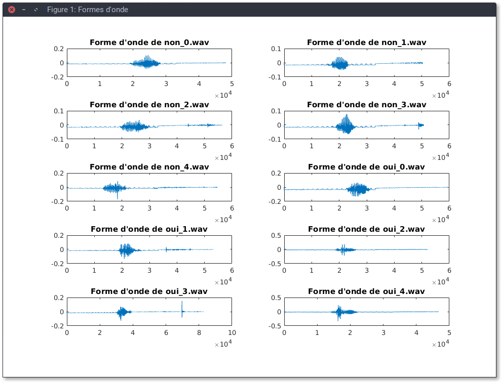

\clearpage

# Introduction

BE.[@BE]

Ce Bureau d'étude est réalisé sous le logiciel `Matlab`.

-----

# Partie 1

-----

## Sous-titre

### Image

### Code

\lstinputlisting{../assets/classifier/knn/dataset/get_datasets.m}

### Tableau

+--------+--------+--------+
|        |  non_0 |  non_1 |
+--------+--------+--------+
|  non_0 |  0.000 |  0.109 |
|  non_1 |  0.109 |  0.000 |
+--------+--------+--------+

-----

# Conclusion

Ce bureau d'étude nous a permis de réaliser...

-----