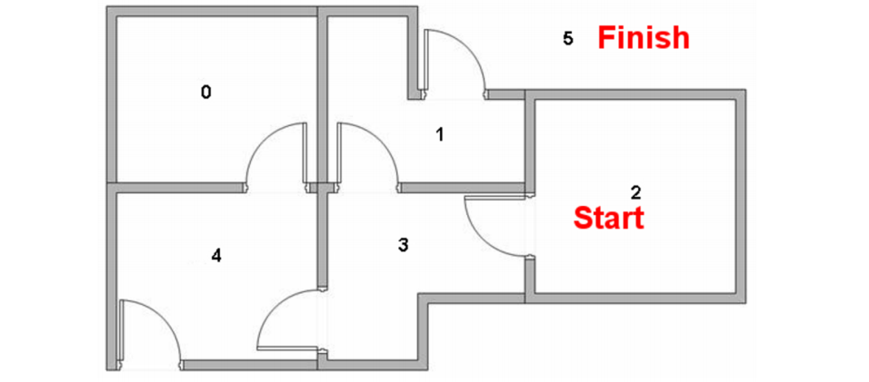

\clearpage

# Introduction

BE.[@BE]


Ce Bureau d'étude est réalisé sous le logiciel `Matlab`.

-----

# KNN

## Knn_compute_distances_two_loops.m

Dans cette partie on commence par implémenter le code qui mesure la matrice distance entre tout les training et les tests exemples.Par exemple si on a Ntr training exemples et Nte exemples test on obtient une matrice de taille Nte*Ntr ou chaque élément (i,j) est la distance entre le i ème test et le j ème train et ceci via un double boucle for.

Ceci est le code :
\lstinputlisting{../assets/classifier/knn/knn_compute_distances_two_loops.m}

Aprés l'exécution on obtient une matrice de taille 500 * 5000:

Imprime écran

## Knn_predict_labes.m

On a implémenté ici la fonction qui prédit le label de chaque exemple test.

En prenant la matrice dists on trie cette matrice aprés on prend les k plus proches labels aprés en utilisant la fonction mod on obtient le label le plus commun càd le label qui se répéte le plus .

Ceci est le code:
\lstinputlisting{../assets/classifier/knn/knn_predict_labels.m}

Le résultat obtenu aprés l'éxécution de cette partie est le suivant avec une accuracy de 0.274000

Imprime écran

## Now lets try out a larger k, say k=5

Dans cette partie on a utilisé un k=5 et on a effectué le test pour obtenir une accuracy égale à ...

Imprime écran

### Image


### Code

\lstinputlisting{../assets/classifier/knn/dataset/get_datasets.m}

### Tableau

+--------+--------+--------+
|        |  non_0 |  non_1 |
+--------+--------+--------+
|  non_0 |  0.000 |  0.109 |
|  non_1 |  0.109 |  0.000 |
+--------+--------+--------+


-----

# SVM

The gradient could not be strictly differentiable, as in our hinge loss case. In a 1D case, a point right before the hinge should have an analytical gradient of 0, while the numerical gradient would be greater than 0.


-----

# Q-Learning

Cet exercice est réalisé en suivant l'exemple de cours [@QL] dont nous reprenons ici l'illustration :



## Configuration

Nous utilisons les données de l'énoncé pour configurer les variables de l'algorithmes. Dans un premier temps, nous considérons la matrice *récompenses* suivante :

$$
R = 
\quad
\begin{pmatrix} 
-1 & -1 & -1 & -1 & 0 & -1 \\
-1 & -1 & -1 & 0 & -1 & 100 \\
-1 & -1 & -1 & 0 & -1 & -1 \\
-1 & 0 & 0 & -1 & 0 & -1 \\
0 & -1 & -1 & 0 & -1 & 100 \\
-1 & 0 & -1 & -1 & 0 & 100 \\
\end{pmatrix}
\quad
$$

Celle-ci est codée en créant une matrice ne comportant que les valeurs -1 (murs), puis en modifiant certaines valeurs à 0 (représentant les portes) et d'autres à 100 (représentant les changements de pièces gagnants).

```python
R = -1*ones(6);
doors = [[0,4]; [4,3]; [4,5]; [2,3]; [1,3]; [1,5]];
wins = [[1,5];[4,5];[5,5]];

for i = 1:size(doors,1) % Création des portes
    R(doors(i,1)+1,doors(i,2)+1) = 0;
    R(doors(i,2)+1,doors(i,1)+1) = 0;
end

for i = 1:size(wins,1) % Chemins gagnants
    R(wins(i,1)+1,wins(i,2)+1) = 100;
end
```

On règle ensuite les paramètres `alpha`, `gamma` et le nombre d'épisodes à réaliser :

```python
alpha = 1;
gamma = .8;
nEpisodes = 100;
```

*NB : Ces paramètres entraîne donc la formule d'apprentissage suivantes (annulation du terme $Q_t(s_t, a_t)$):*

$$
Q_{t+1}(s_t, a_t)=R_{t+1}+0,8*max_aQ_t(s_{t+1}, a_t)
$$

On initialise la matrice d'apprentissage Q et on choisis les états initiaux pour chacun des épisodes de manière aléatoire.

```python
Q = zeros(size(R));
randomStates = randi([1 size(R,2)],1,100);
```

## Fonction récursive `qLearn`

Dans un nouveau fichier `qLearn.m` nous programmons une fonction récursive définie de la manière suivante :

```python
function Q = qLearn(Q,R,alpha,gamma,state,stopState)
```

Nous identifions dans un premier temps les états suivants possibles `possibleNextStates` étant donné l'état courant `state`.
Nous choisissons ensuite aléatoirement l'état suivant `nextState` parmi les possibilités `possibleNextStates`.
Nous identifions ensuite les états futurs possibles `possibleFutureStates` étant donné l'état suivant `nextState`.
Puis nous appliquons la formule d'apprentissage et actualisons la valeur de `Q(state,nextState)` en fonction de `alpha`, `R(state,nextState)`, `gamma` et `max(Q(nextState,possibleFutureStates))`.

Si l'état suivant `nextState` correspond à l'état final, nous arrêtons la récursion, sinon nous rappelons la fonction récursive `qLearn`.

```python
function Q = qLearn(Q,R,alpha,gamma,state, stopState)
    possibleNextStates = find(R(state,:)>=0);
    nextState = possibleNextStates(randi(size(possibleNextStates)));
    possibleFutureStates = find(R(nextState,:)>=0);
    Q(state,nextState) = Q(state,nextState) + alpha * (R(state,nextState) + gamma*max(Q(nextState,possibleFutureStates)) - Q(state,nextState));
    if nextState == stopState
        return
    else
        Q = qLearn(Q,R,alpha,gamma,nextState,stopState);
    end
end
```

Dans le script principal, nous appelons cette fonction sur chacun des épisodes :

```python
for i = 1:nEpisodes % Boucle de nEpisodes
    beginningState = randomStates(i);
    Q = qLearn(Q,R,alpha,gamma,6, 5+1); % Appel de la fonction récursive qLearn
end
```

Enfin nous affichons le résultat :

```python
QNormalized = round(Q./max(max(round(Q)))*100) % Affichage du résultat arrondi
```

## Traces d'exécution

Nous exécutons l'ensemble du code Matlab à partir du fichier `Run_qlearning.m`. Voici le résultat:

```bash
>> Run_qlearning

QNormalized =

     0     0     0     0    80     0
     0     0     0    64     0   100
     0     0     0    64     0     0
     0    80    51     0    80     0
    64     0     0    64     0   100
     0    80     0     0    80   100
```

Nous obtenons effectivement la même matrice résultat que celle se trouvant dans l'énoncé du BE [@QL].


# Conclusion

Ce bureau d'étude nous a permis de réaliser...


-----