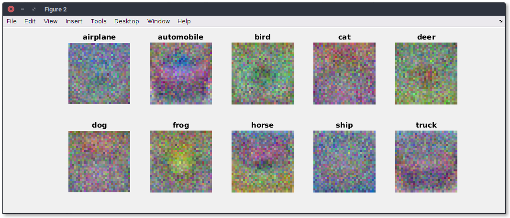

\clearpage

# Introduction

Le présent rapport rend compte de nos travaux lors des séances de Bureau d'Étude et suit le cheminement des énoncés [@BE].

Une première partie de ce rapport concerne la programmation d'un classifieur KNN. Une seconde partie concerne l'apprentissage d'un algorithme SVM. Une troisième partie concerne l'implémentation d'un classifieur de type Softmax. Une quatrième partie concerne la programmation d'un alogorithme de type réseau de neuronnes à deux couches. Enfin, une cinquième partie concerne l'implémentation de l'exemple simple de *QLearning* du dernier BE [@QL].

*NB: Ce Bureau d'étude est réalisé sous le logiciel `Matlab`.*

\noindent
Mots-clés: *kNN, Support Vector Machine, Softmax, Réseau de neuronnes, Images features, QLearning.*


-----

# KNN

## Knn_compute_distances_two_loops.m

Dans cette partie on commence par implémenter le code qui mesure la matrice distance entre tout les training et les tests exemples.Par exemple si on a Ntr training exemples et Nte exemples test on obtient une matrice de taille Nte*Ntr ou chaque élément (i,j) est la distance entre le i ème test et le j ème train et ceci via un double boucle for.

Ceci est le code :
\lstinputlisting{../assets/classifier/knn/knn_compute_distances_two_loops.m}

Aprés l'exécution on obtient une matrice de taille 500 * 5000:

```bash
     500        5000
```

## Knn_predict_labels.m

On a implémenté ici la fonction qui prédit le label de chaque exemple test.

En prenant la matrice dists on trie cette matrice aprés on prend les k plus proches labels aprés en utilisant la fonction mod on obtient le label le plus commun càd le label qui se répéte le plus .

Ceci est le code:
\lstinputlisting{../assets/classifier/knn/knn_predict_labels.m}

Le résultat obtenu aprés l'éxécution de cette partie est le suivant avec une accuracy de 0.274000

```bash
    Got 137 / 500 correct => accuracy: 0.274000 
```

## Now lets try out a larger k, say k=5

Dans cette partie on a utilisé un k=5 et on a effectué le test pour obtenir une accuracy égale à 0.278000

```bash
    Got 139 / 500 correct => accuracy: 0.278000
```

## knn_compute_distance_one_loop.m

Dans cette partie on amélioré l'algorithme qui calcule la matrice dists en utilisant une vectorisation partielle avec un seul boucle for.

On peut vérifier maintenant qu'on obtient la même résultat que précédemment

\lstinputlisting{../assets/classifier/knn/knn_compute_distances_one_loops.m}

```bash
    Difference was: 0.000000
    Good! The distance matrices are the same
```


## knn_compute_distances_no_loops.m

Maintenant on améliore mieux notre algorithme en calculant la matrice dists sans aucun boucle .

Ceci est le code:
\lstinputlisting{../assets/classifier/knn/knn_compute_distances_no_loops.m}

On vérifie bien qu'on obtient le même résultat que précédemment

```bash
    Difference was: 0.000000
    Good! The distance matrices are the same
```

## Let’s compare how fast the implementations are

Ici on a comparé la vitesse d'éxécution de nos trois versions de clacul de la matrice dists et on remarque selon les résultats que la version knn_compute_distance_no_loops est la plus rapide 

```bash
Two loop version took 246.553474 seconds
One loop version took 51.098205 seconds
No loop version took 0.508954 seconds
```

## Cross-validation

Nous avons implémenté le k-Nearest Neighbor classificateur, mais nous avons fixé la valeur k = 5 arbitrairement. Nous allons maintenant déterminer la meilleure valeur de cet hyperparamètre avec cross validation.

Nous avons divisé nos données en 5 folds ou à chaque fois on prnd une valeur de k et on utilise 4 folds pour  trainer notre model et une pour le test .

```
% ################################################################################
% # TODO:                                                                        #
% # Split up the training data into folds. After splitting, X_train_folds and    #
% # y_train_folds should each be lists of length num_folds, where                #
% # y_train_folds[i] is the label vector for the points in X_train_folds[i].     #
% # Hint: Look up the mat2cell function.                                #
% ################################################################################

X_train_folds= mat2cell(imdb.train_data, ones(1,num_folds)*(size(imdb.train_data,1)/num_folds));
y_train_folds= mat2cell(imdb.train_labels, ones(1,num_folds)*(size(imdb.train_labels,1)/num_folds));

% ################################################################################
% #                                 END OF YOUR CODE                             #
% ################################################################################
% 
% # A dictionary holding the accuracies for different values of k that we find
% # when running cross-validation. After running cross-validation,
% # k_to_accuracies[k] should be a list of length num_folds giving the different
% # accuracy values that we found when using that value of k.

k_to_accuracies = zeros(length(k_choices), num_folds);


% ################################################################################
% # TODO:                                                                        #
% # Perform k-fold cross validation to find the best value of k. For each        #
% # possible value of k, run the k-nearest-neighbor algorithm num_folds times,   #
% # where in each case you use all but one of the folds as training data and the #
% # last fold as a validation set. Store the accuracies for all fold and all     #
% # values of k in the k_to_accuracies dictionary.                               #
% ################################################################################
for i = 1:length(k_choices)
    for j = 1:num_folds
	   model = knn_train(cell2mat(X_train_folds(setdiff(1:num_folds,j))), cell2mat(y_train_folds(setdiff(1:num_folds,j))));
	   dists_no = knn_compute_distances_no_loops(model, cell2mat(X_train_folds(j)));
	   test_labels_pred = knn_predict_labels(model, dists_no, k_choices(i));
       num_correct = sum(sum(test_labels_pred == cell2mat(y_train_folds(j))));
       num_test = length(cell2mat(y_train_folds(j)));
       accuracy = double(num_correct)/num_test;
	   k_to_accuracies(i,j)=accuracy;
	end
end 

% ################################################################################
% #                                 END OF YOUR CODE                             #
% ################################################################################


```


Pour chaque valeur de k on obtient les résultats suivants: 

```bash
   k = 1, accuracy = 0.263000
k = 1, accuracy = 0.257000
k = 1, accuracy = 0.264000
k = 1, accuracy = 0.278000
k = 1, accuracy = 0.266000
k = 3, accuracy = 0.239000
k = 3, accuracy = 0.249000
k = 3, accuracy = 0.240000
k = 3, accuracy = 0.266000
k = 3, accuracy = 0.254000
k = 5, accuracy = 0.248000
k = 5, accuracy = 0.266000
k = 5, accuracy = 0.280000
k = 5, accuracy = 0.292000
k = 5, accuracy = 0.280000
k = 8, accuracy = 0.262000
k = 8, accuracy = 0.282000
k = 8, accuracy = 0.273000
k = 8, accuracy = 0.290000
k = 8, accuracy = 0.273000
k = 10, accuracy = 0.265000
k = 10, accuracy = 0.296000
k = 10, accuracy = 0.276000
k = 10, accuracy = 0.284000
k = 10, accuracy = 0.280000
k = 12, accuracy = 0.260000
k = 12, accuracy = 0.295000
k = 12, accuracy = 0.279000
k = 12, accuracy = 0.283000
k = 12, accuracy = 0.280000
k = 15, accuracy = 0.252000
k = 15, accuracy = 0.289000
k = 15, accuracy = 0.278000
k = 15, accuracy = 0.282000
k = 15, accuracy = 0.274000
k = 20, accuracy = 0.270000
k = 20, accuracy = 0.279000
k = 20, accuracy = 0.279000
k = 20, accuracy = 0.282000
k = 20, accuracy = 0.285000
k = 50, accuracy = 0.271000
k = 50, accuracy = 0.288000
k = 50, accuracy = 0.278000
k = 50, accuracy = 0.269000
k = 50, accuracy = 0.266000
k = 100, accuracy = 0.256000
k = 100, accuracy = 0.270000
k = 100, accuracy = 0.263000
k = 100, accuracy = 0.256000
k = 100, accuracy = 0.263000
```


En se basant sur ces résultats on remarque que la meilleure valeur de k est : 6

On mettant k = 6
on traine notre model sur tout nos données train et on test sur nos données test on obtient le résultat suivant avec une accuracy égale à peu prés à 0.282000

```bash
    Got 141 / 500 correct => accuracy: 0.282000
``` 

-----

# SVM

## `svm_loss_naive.m`

Nous implémentons dans un premier temps la fonction *loss* ainsi que le gradient dans le fichier `svm_loss_naive.m`

```
function [ loss, dW ] = svm_loss_naive( W, X, y, reg )

    dW = zeros(size(W));
    num_classes = size(W,1);
    num_train = size(X, 1);

    loss = 0.0;
    for i = 1:num_train
        scores = W*X(i, :)';
        correct_class_score = scores(y(i));
        for j = 1:num_classes
        if j == y(i)
            continue;
        end
        margin = scores(j) - correct_class_score + 1; % note delta = 1
        if margin > 0
            loss = loss + margin;
            %your code 
            dW(j,:) = dW(j,:) + X(i, :);
            dW(y(i),:) = dW(y(i),:) - X(i, :);
        end
        end
    end

    % Right now the loss is a sum over all training examples, but we want it
    % to be an average instead so we divide by num_train
    loss = loss/num_train;

    % Average gradients as well
    %your code 
    dW = dW/num_train;

    % Add regularization to the loss.
    loss = loss + 0.5 * reg * sum(sum((W.*W)));

    % Add regularization to the gradient
    % your code
    dW = dW + reg * W;

end
```

### Gradcheck

Ce code permet la comparaison du calcul du *loss* analitique et numérique :

```bash
numerical: -11.624341 analytic: -11.623547, relative error: 3.416353e-05
numerical: -2.967959 analytic: -2.968469, relative error: 8.596690e-05
numerical: 1.370071 analytic: 1.370463, relative error: 1.429105e-04
numerical: -34.207994 analytic: -34.207484, relative error: 7.450883e-06
numerical: 15.514664 analytic: 15.515966, relative error: 4.194596e-05
numerical: -0.409555 analytic: -0.408745, relative error: 9.892837e-04
numerical: 15.763268 analytic: 15.764060, relative error: 2.509722e-05
numerical: -25.588662 analytic: -25.588890, relative error: 4.470214e-06
numerical: -4.197175 analytic: -4.193180, relative error: 4.760962e-04
numerical: -9.371776 analytic: -9.370036, relative error: 9.280094e-05
```

Avec le terme de régularisation nous obetnons :

```bash
numerical: 16.210153 analytic: 16.211038, relative error: 2.730251e-05
numerical: -1.609398 analytic: -1.615602, relative error: 1.923819e-03
numerical: -17.736330 analytic: -17.721728, relative error: 4.118093e-04
numerical: -11.510254 analytic: -11.493891, relative error: 7.113270e-04
numerical: -6.772364 analytic: -6.775551, relative error: 2.352329e-04
numerical: 9.015804 analytic: 9.005720, relative error: 5.595433e-04
numerical: -8.930279 analytic: -8.915413, relative error: 8.330575e-04
numerical: 2.049767 analytic: 2.052767, relative error: 7.311906e-04
numerical: 27.281231 analytic: 27.279314, relative error: 3.513422e-05
numerical: 26.358994 analytic: 26.371298, relative error: 2.333422e-04
```


Les erreurs sont extrêmement faibles, nous supposons que l'implémentation est juste.

### Inline Question 1

**It is possible that once in a while a dimension in the gradcheck will not match exactly. What could such a discrepancy be caused by? Is it a reason for concern? What is a simple example in one dimension where a gradient check could fail? Hint: the SVM loss function is not strictly speaking differentiable.**

Le gradient n'est pas strictement différentiable. En considérant une dimension, un point peut avoir un gradient analytique nul et un gradient numérique positif par exemple. D'où la possibilité d'une erreur dans le *gradcheck* pour certaines dimensions de temps en temps. Ceci ne doit pas être préoccupant pour autant.

## `svm_loss_vectorized.m`

Nous implémentons la version vectorisée de l'aglorithme précédent :

### Loss

```
num_classes = size(W,1);

scores = W * X';
correct_indexes = (0:num_train-1)*num_classes+double(y');
correct_class_score = ones(num_classes,1)*scores(correct_indexes);
L = scores - correct_class_score + 1; % delta = 1

L(L<0) = 0;
loss = sum(sum(L))- 1*num_train; % On retire les Lyi comptés en trop
loss = loss/num_train;

% Regularization
loss = loss + 0.5 * reg * sum(sum((W.*W)));
```

### Gradient

```
L(L>0) = 1;
L(correct_indexes) = -sum(L);
dW=L*X;

dW = dW/num_train;
% Add regularization to the gradient
dW = dW + reg * W;

```

### Résultats

Nous obetnons les résultats suivant :

```bash
Naive loss: 9.150210e+00 computed in 38.956417s
Vectorized loss: 9.150210e+00 computed in 0.780730s
difference: -0.000000

Naive loss and gradient: computed in 36.895610s
Vectorized loss and gradient: computed in 0.480518s
difference: 291.412469
```

La différence est numériquement nulle : nous considérons que l'implémentation est correcte. Nous remarquons l'efficacité de la version vectorisée par rapport à la version analitique.

## Stochastic Gradient Descent

Nous implémentons le SGD dans le fichier `linear_svm_train.m`.

```
...
        rand_idx = randsample(num_train, batch_size);
        X_batch = X(rand_idx, :);
        y_batch = y(rand_idx);

        %evaluate loss and gradient
        [loss, grad] = self_loss(W, X_batch, y_batch, reg);
        loss_hist(it) = loss;
        
%perform parameter update
        W = W - learning_rate * grad;
...
```

Nous obtenons la descente suivante (cf. figure).


## `linear_svm_predict.m`

La fonction de prédiction s'écrit simplement de la manière suivante :

```
function [ y_pred ] = linear_svm_predict( model, X )
    y_pred = [];
        scores = model.W * X';
        [~,y_pred] = max(scores);
end
```

## Configuration des hyperparamètres dans le script `Run_svm.m`

Afin de choisir les meilleurs paramètres, nous créons une boucle testants l'ensemble des paramètres choisis :

```
iter_num = 1000;
%iter_num = 100;
for i = 1:length(learning_rates)
    learning = learning_rates(i);
    for j = 1:length(regularization_strengths)
        regularization = regularization_strengths(j);
        [model, loss_hist] = linear_svm_train(imdb.X_train, imdb.y_train, learning, regularization, iter_num);
        y_train_pred = linear_svm_predict(model, imdb.X_train);
        train_accuracy = mean(imdb.y_train == y_train_pred');
        fprintf('training accuracy: %f', train_accuracy); % (train_accuracy)
        y_val_pred = linear_svm_predict(model, imdb.X_val);
        val_accuracy = mean(imdb.y_val' == y_val_pred);
        fprintf('validation accuracy: %f', val_accuracy);  % (val_accuracy)
        
        if val_accuracy > best_val
            best_val = val_accuracy;
            best_svm = model;
        end
        
        results(i, j, :) = [train_accuracy, val_accuracy];
    end
end
```

Visualisation des expériences :


Les meilleurs résultats retournés sont : 

```bash
...
lr 1.000000e-07 reg 3.000000e+04 train accuracy: 0.379776 val accuracy: 0.390000
...
best validation accuracy achieved during cross-validation: 0.390000
linear SVM on raw pixels final test set accuracy: 0.382000
```

## Visualisation des résultats

Voici les matrices images résultantes de l'apprentissage de l'algorithme pour chacune des classes d'images:




### Inline Question 2

**Describe what your visualized SVM weights look like, and offer a brief explanation for why they look they way that they do.**

Ces matrices images sont les représentations de chaque classe pour la SVM. Elles sont très distinctes en termes de couleurs par rapport à chaque région de l'image car la SVM sépare au mieux chaque classe, d'où ces représentations singulières.


-----

# SoftMax

L'algorithme SoftMax se différencie du classifieur SVM notamment par le retour d'une probabilité d'appartenance aux classes plutôt que le retour d'une calssification simple à l'utilisateur. SoftMax généralise la régression logistique à plusieurs classes.

## `softmax_loss_naive`

Nous implémentons dans un premier temps la fonction *loss* ainsi que le gradient dans le fichier `softmax_loss_naive.m`

```
function [ loss, dW ] = softmax_loss_naive( W, X, y, reg )

% Initialize the loss and gradient to zero.
  loss = 0.0;
  dW = zeros(size(W));

  num_class = size(W,1);
  num_train = size(X,1);
  
  for i = 1:num_train
      scores = W*X(i, :)';
      scores = scores - max(scores);

      sum_exp = sum(exp(scores));
      loss = loss -log(exp(scores(y(i)))/sum_exp);

      for j = 1:num_class
      
        dW(j,:) = dW(j,:) + exp(scores(j))/sum_exp*X(i, :);

        if j == y(i)
          dW(j,:) = dW(j,:) - X(i, :);
        end

      end
  end

  % Right now the loss is a sum over all training examples, but we want it
  % to be an average instead so we divide by num_train
  loss = loss/num_train;

  % Average gradients as well
  dW = dW/num_train;

  % Add regularization to the loss.
  loss = loss + 0.5 * reg * sum(sum((W.*W)));

  % Add regularization to the gradient
  % your code
  dW = dW + reg * W;

end
```

### Gradcheck

Ce code permet la comparaison du calcul du *loss* analitique et numérique :

```bash
numerical: 1.460241 analytic: 1.460241, relative error: 4.602831e-08
numerical: -0.917689 analytic: -0.917689, relative error: 1.943096e-08
numerical: 1.647922 analytic: 1.647922, relative error: 4.257335e-08
numerical: -0.161815 analytic: -0.161815, relative error: 1.431171e-07
numerical: -0.201888 analytic: -0.201889, relative error: 4.207505e-07
numerical: -1.439165 analytic: -1.439165, relative error: 3.392779e-09
numerical: 2.334927 analytic: 2.334927, relative error: 2.989751e-08
numerical: 2.074058 analytic: 2.074058, relative error: 3.641542e-08
numerical: 1.029669 analytic: 1.029669, relative error: 5.111217e-08
numerical: 3.549438 analytic: 3.549438, relative error: 2.802475e-09
```

Avec le terme de régularisation nous obetnons :

```bash
numerical: -3.625634 analytic: -3.622718, relative error: 4.023212e-04
numerical: -1.654415 analytic: -1.634746, relative error: 5.979858e-03
numerical: 2.343703 analytic: 2.345992, relative error: 4.879353e-04
numerical: -3.047483 analytic: -3.060509, relative error: 2.132565e-03
numerical: 1.060127 analytic: 1.058400, relative error: 8.149228e-04
numerical: -0.253623 analytic: -0.250525, relative error: 6.145836e-03
numerical: 1.996955 analytic: 1.970200, relative error: 6.744259e-03
numerical: 1.490734 analytic: 1.479275, relative error: 3.858266e-03
numerical: -1.422064 analytic: -1.421236, relative error: 2.911050e-04
numerical: -0.208817 analytic: -0.207548, relative error: 3.046673e-0
```

Les erreurs sont extrêmement faibles, nous supposons que l'implémentation est juste.

## `svm_loss_vectorized.m`

Nous implémentons la version vectorisée de l'aglorithme précédent :

### Loss

```
  num_class = size(W,1);
  num_train = size(X,1);
  
  scores = W*X';
  scores = scores - ones(num_class,1)*max(scores);
  correct_indexes = (0:num_train-1)*num_class+double(y');

  sum_exp = sum(exp(scores));
  loss = sum(- log(exp(scores(correct_indexes)./sum_exp)));

  L = exp(scores)./(ones(num_class,1)*sum_exp);
  L(correct_indexes) = L(correct_indexes)-1;

  dW=L*X;

  % Right now the loss is a sum over all training examples, but we want it
  % to be an average instead so we divide by num_train
  loss = loss/num_train;

  % Average gradients as well
  dW = dW/num_train;

  % Add regularization to the loss.
  loss = loss + 0.5 * reg * sum(sum((W.*W)));

  % Add regularization to the gradient
  % your code
  dW = dW + reg * W;
```

### Résultats

Nous obetnons les résultats suivant :

```bash
Naive loss: 2.410764e+00 computed in 23.085370s
Vectorized loss: 1.036558e-01 computed in 0.779152s
Loss difference: 2.307108
Gradient difference: 0.000000
```

La différence est numériquement nulle : nous considérons que l'implémentation est correcte. Nous remarquons l'efficacité de la version vectorisée par rapport à la version analitique.

## Stochastic Gradient Descent

Nous implémentons le SGD dans le fichier `linear_softmax_train.m`. L'implémentation est identique à celle du classifieur SVM.

```
...
        rand_idx = randsample(num_train, batch_size);
        X_batch = X(rand_idx, :);
        y_batch = y(rand_idx);

        %evaluate loss and gradient
        [loss, grad] = self_loss(W, X_batch, y_batch, reg);
        loss_hist(it) = loss;
        
%perform parameter update
        W = W - learning_rate * grad;
...
```

## `linear_softmax_predict.m`

La fonction de prédiction s'écrit simplement de la manière suivante, tout comme le classifieur SVM :

```
function [ y_pred ] = linear_softmax_predict( model, X )
    y_pred = [];
        scores = model.W * X';
        [~,y_pred] = max(scores);
end
```

## Configuration des hyperparamètres dans le script `Run_softmax.m`

Afin de choisir les meilleurs paramètres, nous créons une boucle testants l'ensemble des paramètres choisis. Il s'agit de la même boucle que celle utilisée pour le classifieur SVM :

```
iter_num = 1000;
%iter_num = 100;
for i = 1:length(learning_rates)
    learning = learning_rates(i);
    for j = 1:length(regularization_strengths)
        regularization = regularization_strengths(j);
        [model, loss_hist] = linear_softmax_train(imdb.X_train, imdb.y_train, learning, regularization, iter_num);
        y_train_pred = linear_softmax_predict(model, imdb.X_train);
        train_accuracy = mean(imdb.y_train == y_train_pred');
        fprintf('training accuracy: %f', train_accuracy); % (train_accuracy)
        y_val_pred = linear_softmax_predict(model, imdb.X_val);
        val_accuracy = mean(imdb.y_val' == y_val_pred);
        fprintf('validation accuracy: %f', val_accuracy);  % (val_accuracy)
        
        if val_accuracy > best_val
            best_val = val_accuracy;
            best_softmax = model;
        end
        
        results(i, j, :) = [train_accuracy, val_accuracy];
    end
end
```

Les meilleurs résultats retournés sont : 

```bash
...
lr 5.000000e-07 reg 5.000000e+04 train accuracy: 0.325959 val accuracy: 0.341000
...
best validation accuracy achieved during cross-validation: 0.341000
linear Softmax on raw pixels final test set accuracy: 0.333000
```

## Visualisation des résultats

Voici les matrices images résultantes de l'apprentissage de l'algorithme pour chacune des classes d'images :


On remarque que les images sont bien plus lisses que celles générées par le classifieur SVM. C'est normal puisque SoftMax ne cherche pas à éloigner les classes le plus possibles les unes par rapport aux autres dans un hyperplan mais d'afficher les probabilités d'appartenance à des classes.


-----

# Neural Network

Dans cette exercice on a développé un réseau de neuronnes composé de deux couches.

## Forward pass: compute scores

Dans cette partie on a implémenté la prmière partie de la fonction twolayernet_loss qui prend les données et les poids et calcule ainsi les scores des classes

```
    res=X * model.W1 + repmat(model.b1,N,1);
    hidden_layer = max(0,res);
    scores =hidden_layer * model.W2 + repmat(model.b2,N,1);
```


on obtient comme résultats la différence entre nos scores et les scores correctes :

```bash
Your scores:
    0.3967   -0.1384   -0.4843
    0.8566    0.4300    0.9894
    0.3361   -0.2670   -0.5919
   -0.1935    0.3000    0.3927
    0.2673   -0.6787    0.0901

Correct scores:
    0.3967   -0.1384   -0.4843
    0.8566    0.4300    0.9894
    0.3361   -0.2670   -0.5919
   -0.1935    0.3000    0.3927
    0.2673   -0.6787    0.0901

Difference between your scores and correct scores:
3.291676e-08

```
## Forward pass: compute loss

Dans la deuxième partie on s'occupe du calcul du loss et du "regularization loss"

```
scores = exp(scores) ./ repmat(sum(exp(scores),2),1,size(scores,2)); 
	true_class = false(size(scores));
	true_class(sub2ind(size(scores),1:N,y')) = 1; 
	loss = - sum(sum(true_class .* log(scores)));
    
    loss = loss ./ N;
    loss = loss + 0.5 * reg * (sum(sum((model.W1.*model.W1))) + sum(sum((model.W2.*model.W2))));
	

```

On obtient le résultat suivant:

```bash
Difference between your loss and correct loss:
2.220446e-16

```

## Backward pass

Aprés l'implémentation du forward pass on a débuggé notre backward pass en utilisant le gradient numérique.

On a obtenu le résultat suivant :

```bash
W1 max relative error :2.222322e-10
b1 max relative error :4.363546e-09
W2 max relative error :1.878299e-10
b2 max relative error :3.292164e-11

```


## Train the network

Dans cette partie on a implémenté la fonction twoLayernet_train qui s'occupe de la procédure du train de notre data.

```
sample_indexes = randsample(num_train, batch_size, true);
        X_batch = X(sample_indexes, :);
        y_batch = y(sample_indexes, :); 
```

```
 model.W1 = model.W1 - lr .* grads.W1;
        model.b1 = model.b1 - lr .* grads.b1;
        model.W2 = model.W2 - lr .* grads.W2;
        model.b2 = model.b2 - lr .* grads.b2;
```
Aprés on implémente la fonction twoLayernet_predict pour que notre algorithme effectue la procédure de prédiction à fur et à mesure que notre modèle s'entraîne 

```
 scores = twolayernet_loss( model, X);
 [~,y_pred] = max(scores,[],2); 
 y_pred = y_pred'; 

```
Enfin on applique ce notre modèle sur les données toy et on obtient le résultat suivant:

```bash
Final training loss: 0.033668

```


## Train a network

Maintenant on applique notre modèle de réseaux de neuronnes sur notre base de données CIFAR-10 .

On obtient le résultat suivant :

```bash
Validation accuracy: 0.290000

```

## Debug the training

Avec les paramètres par défaut , nous avons obtenu une précision de validation d'environ 0,29 sur l'ensemble de validation. Ce n'est pas très bon.

Une stratégie pour obtenir un aperçu de ce qui ne va pas est de tracer la fonction de perte et les précisions sur les ensembles de formation et de validation au cours de l'optimisation.

Une autre stratégie est de visualiser les poids qui ont été apprises dans la première couche du réseau. Dans la plupart des réseaux de neurones formés sur des données visuelles, les poids des premières couches montrent typiquement une certaine structure visible lorsqu'ils sont visualisés.

On a obtenu les résultats suivants:


## Tune your hyperparameters

En regardant les visualisations ci-dessus, nous voyons que la perte diminue plus ou moins linéairement, ce qui semble suggérer que le taux d'apprentissage peut être trop faible. En outre, il n'y a pas d'écart entre la formation et la précision de validation, ce qui suggère que le modèle que nous avons utilisé a une faible capacité, et que nous devrions augmenter sa taille. D'autre part, avec un modèle très grand nous nous attendons à voir plus de surfaçage, ce qui se manifesterait comme un très grand écart entre la formation et la précision de validation.

Réglage: Le tuning des hyperparamètres et le développement de l'intuition pour la façon dont ils affectent la performance finale est une grande partie de l'utilisation de réseaux neuronaux, donc nous avons testé différentes valeurs des différents hyperparamètres, y compris la taille de la couche cachée, le taux d'apprentissage, le nombre d'époques de formation et la force de régularisation. 

Ceci sont les résultats de l'exécution de plusieurs paramètres:

```bash
learning_rates =

    0.0010    0.0012    0.0014    0.0016    0.0018


regularization_strengths =

    0.0001    0.0010    0.0100

iteration 100 / 1000: loss 1.903683
iteration 200 / 1000: loss 1.636565
iteration 300 / 1000: loss 1.641478
iteration 400 / 1000: loss 1.621771
iteration 500 / 1000: loss 1.456343
iteration 600 / 1000: loss 1.460929
iteration 700 / 1000: loss 1.463524
iteration 800 / 1000: loss 1.463505

iteration 900 / 1000: loss 1.393585
iteration 1000 / 1000: loss 1.322047
Validation accuracy: 0.490000
Training  accuracy: 0.518347
iteration 100 / 1000: loss 1.904105
iteration 200 / 1000: loss 1.774876
iteration 300 / 1000: loss 1.496898
iteration 400 / 1000: loss 1.555693
iteration 500 / 1000: loss 1.633709
iteration 600 / 1000: loss 1.651791
iteration 700 / 1000: loss 1.563845
iteration 800 / 1000: loss 1.416447
iteration 900 / 1000: loss 1.408721
iteration 1000 / 1000: loss 1.336831
Validation accuracy: 0.485000
Training  accuracy: 0.516796
iteration 100 / 1000: loss 1.811813
iteration 200 / 1000: loss 1.727382
iteration 300 / 1000: loss 1.545152
iteration 400 / 1000: loss 1.629504
iteration 500 / 1000: loss 1.554959
iteration 600 / 1000: loss 1.524282
iteration 700 / 1000: loss 1.435830
iteration 800 / 1000: loss 1.421068
iteration 900 / 1000: loss 1.394621
iteration 1000 / 1000: loss 1.430174
Validation accuracy: 0.510000
Training  accuracy: 0.522388
iteration 100 / 1000: loss 1.804657
iteration 200 / 1000: loss 1.665018
iteration 300 / 1000: loss 1.725068
iteration 400 / 1000: loss 1.535670
iteration 500 / 1000: loss 1.518353
iteration 600 / 1000: loss 1.384023
iteration 700 / 1000: loss 1.421567
iteration 800 / 1000: loss 1.373386
iteration 900 / 1000: loss 1.330950
iteration 1000 / 1000: loss 1.289464
Validation accuracy: 0.498000
Training  accuracy: 0.531061
iteration 100 / 1000: loss 1.781222
iteration 200 / 1000: loss 1.702435
iteration 300 / 1000: loss 1.593191
iteration 400 / 1000: loss 1.723586
iteration 500 / 1000: loss 1.420244
iteration 600 / 1000: loss 1.386560
iteration 700 / 1000: loss 1.441649
iteration 800 / 1000: loss 1.349473
iteration 900 / 1000: loss 1.356554
iteration 1000 / 1000: loss 1.282630
Validation accuracy: 0.510000
Training  accuracy: 0.532959
iteration 100 / 1000: loss 1.931708
iteration 200 / 1000: loss 1.651993
iteration 300 / 1000: loss 1.590922
iteration 400 / 1000: loss 1.559152
iteration 500 / 1000: loss 1.697657
iteration 600 / 1000: loss 1.492961
iteration 700 / 1000: loss 1.374037
iteration 800 / 1000: loss 1.421492
iteration 900 / 1000: loss 1.344937
iteration 1000 / 1000: loss 1.213988
Validation accuracy: 0.505000
Training  accuracy: 0.532041
iteration 100 / 1000: loss 1.808981
iteration 200 / 1000: loss 1.573783
iteration 300 / 1000: loss 1.539135
iteration 400 / 1000: loss 1.457809
iteration 500 / 1000: loss 1.283784
iteration 600 / 1000: loss 1.449369
iteration 700 / 1000: loss 1.379810
iteration 800 / 1000: loss 1.447453
iteration 900 / 1000: loss 1.390426
iteration 1000 / 1000: loss 1.311496
Validation accuracy: 0.500000
Training  accuracy: 0.527735
iteration 100 / 1000: loss 1.720014
iteration 200 / 1000: loss 1.570176
iteration 300 / 1000: loss 1.600037
iteration 400 / 1000: loss 1.462041
iteration 500 / 1000: loss 1.483315
iteration 600 / 1000: loss 1.533069
iteration 700 / 1000: loss 1.576869
iteration 800 / 1000: loss 1.376747
iteration 900 / 1000: loss 1.458531
iteration 1000 / 1000: loss 1.346602
Validation accuracy: 0.491000
Training  accuracy: 0.530939
iteration 100 / 1000: loss 1.821238
iteration 200 / 1000: loss 1.479453
iteration 300 / 1000: loss 1.472303
iteration 400 / 1000: loss 1.443743
iteration 500 / 1000: loss 1.487051
iteration 600 / 1000: loss 1.333492
iteration 700 / 1000: loss 1.392957
iteration 800 / 1000: loss 1.513533
iteration 900 / 1000: loss 1.393972
iteration 1000 / 1000: loss 1.268021
Validation accuracy: 0.502000
Training  accuracy: 0.539286
iteration 100 / 1000: loss 1.792681
iteration 200 / 1000: loss 1.702588
iteration 300 / 1000: loss 1.788473
iteration 400 / 1000: loss 1.564035
iteration 500 / 1000: loss 1.496648
iteration 600 / 1000: loss 1.454632
iteration 700 / 1000: loss 1.491677
iteration 800 / 1000: loss 1.305490
iteration 900 / 1000: loss 1.352255
iteration 1000 / 1000: loss 1.382465
Validation accuracy: 0.481000
Training  accuracy: 0.513571
iteration 100 / 1000: loss 1.754390
iteration 200 / 1000: loss 1.632650
iteration 300 / 1000: loss 1.673946
iteration 400 / 1000: loss 1.447363
iteration 500 / 1000: loss 1.367191
iteration 600 / 1000: loss 1.427610
iteration 700 / 1000: loss 1.547778
iteration 800 / 1000: loss 1.380027
iteration 900 / 1000: loss 1.402339
iteration 1000 / 1000: loss 1.487833
Validation accuracy: 0.469000
Training  accuracy: 0.503878
iteration 100 / 1000: loss 1.810655
iteration 200 / 1000: loss 1.747407
iteration 300 / 1000: loss 1.586502
iteration 400 / 1000: loss 1.659747
iteration 500 / 1000: loss 1.436031
iteration 600 / 1000: loss 1.473786
iteration 700 / 1000: loss 1.433004
iteration 800 / 1000: loss 1.450502
iteration 900 / 1000: loss 1.373242
iteration 1000 / 1000: loss 1.443666
Validation accuracy: 0.496000
Training  accuracy: 0.523449
iteration 100 / 1000: loss 1.727602
iteration 200 / 1000: loss 1.628511
iteration 300 / 1000: loss 1.509322
iteration 400 / 1000: loss 1.587583
iteration 500 / 1000: loss 1.343200
iteration 600 / 1000: loss 1.648361
iteration 700 / 1000: loss 1.457396
iteration 800 / 1000: loss 1.425397
iteration 900 / 1000: loss 1.358633
iteration 1000 / 1000: loss 1.223938
Validation accuracy: 0.475000
Training  accuracy: 0.522041
iteration 100 / 1000: loss 1.790758
iteration 200 / 1000: loss 1.738118
iteration 300 / 1000: loss 1.511065
iteration 400 / 1000: loss 1.529767
iteration 500 / 1000: loss 1.585005
iteration 600 / 1000: loss 1.406300
iteration 700 / 1000: loss 1.548104
iteration 800 / 1000: loss 1.552658
iteration 900 / 1000: loss 1.472558
iteration 1000 / 1000: loss 1.204736
Validation accuracy: 0.479000
Training  accuracy: 0.535816
iteration 100 / 1000: loss 1.840080
iteration 200 / 1000: loss 1.682401
iteration 300 / 1000: loss 1.514167
iteration 400 / 1000: loss 1.407145
iteration 500 / 1000: loss 1.446941
iteration 600 / 1000: loss 1.400097
iteration 700 / 1000: loss 1.401598
iteration 800 / 1000: loss 1.508011
iteration 900 / 1000: loss 1.495618
iteration 1000 / 1000: loss 1.296093
Validation accuracy: 0.476000
Training  accuracy: 0.540143
Warning: Image is too big to fit on screen; displaying at 67%
> In images.internal.initSize (line 71)
  In imshow (line 309)
  In Run_two_layer_net/show_net_weights (line 186)
  In Run_two_layer_net (line 273)
Test accuracy: 0.495000

```
On a testé 15 combinaisons différentes et on a obtenu pour certaines de très bonnes résultats d'accuracy.

Finalement quand on a évalué notre réseau formé final sur l'ensemble de test, nous avons trouvé une accuracy = 0.495000

# Q-Learning

Cet exercice est réalisé en suivant l'exemple de cours [@QL] dont nous reprenons ici l'illustration :


## Configuration

Nous utilisons les données de l'énoncé pour configurer les variables de l'algorithmes. Dans un premier temps, nous considérons la matrice *récompenses* suivante :

$$
R = 
\quad
\begin{pmatrix} 
-1 & -1 & -1 & -1 & 0 & -1 \\
-1 & -1 & -1 & 0 & -1 & 100 \\
-1 & -1 & -1 & 0 & -1 & -1 \\
-1 & 0 & 0 & -1 & 0 & -1 \\
0 & -1 & -1 & 0 & -1 & 100 \\
-1 & 0 & -1 & -1 & 0 & 100 \\
\end{pmatrix}
\quad
$$

Celle-ci est codée en créant une matrice ne comportant que les valeurs -1 (murs), puis en modifiant certaines valeurs à 0 (représentant les portes) et d'autres à 100 (représentant les changements de pièces gagnants).

```
R = -1*ones(6);
doors = [[0,4]; [4,3]; [4,5]; [2,3]; [1,3]; [1,5]];
wins = [[1,5];[4,5];[5,5]];

for i = 1:size(doors,1) % Création des portes
    R(doors(i,1)+1,doors(i,2)+1) = 0;
    R(doors(i,2)+1,doors(i,1)+1) = 0;
end

for i = 1:size(wins,1) % Chemins gagnants
    R(wins(i,1)+1,wins(i,2)+1) = 100;
end
```

On règle ensuite les paramètres `alpha`, `gamma` et le nombre d'épisodes à réaliser :

```
alpha = 1;
gamma = .8;
nEpisodes = 100;
```

*NB : Ces paramètres entraîne donc la formule d'apprentissage suivantes (annulation du terme $Q_t(s_t, a_t)$):*

$$
Q_{t+1}(s_t, a_t)=R_{t+1}+0,8*max_aQ_t(s_{t+1}, a_t)
$$

On initialise la matrice d'apprentissage Q et on choisis les états initiaux pour chacun des épisodes de manière aléatoire.

```
Q = zeros(size(R));
randomStates = randi([1 size(R,2)],1,100);
```

## Fonction récursive `qLearn`

Dans un nouveau fichier `qLearn.m` nous programmons une fonction récursive définie de la manière suivante :

```
function Q = qLearn(Q,R,alpha,gamma,state,stopState)
```

Nous identifions dans un premier temps les états suivants possibles `possibleNextStates` étant donné l'état courant `state`.
Nous choisissons ensuite aléatoirement l'état suivant `nextState` parmi les possibilités `possibleNextStates`.
Nous identifions ensuite les états futurs possibles `possibleFutureStates` étant donné l'état suivant `nextState`.
Puis nous appliquons la formule d'apprentissage et actualisons la valeur de `Q(state,nextState)` en fonction de `alpha`, `R(state,nextState)`, `gamma` et `max(Q(nextState,possibleFutureStates))`.

Si l'état suivant `nextState` correspond à l'état final, nous arrêtons la récursion, sinon nous rappelons la fonction récursive `qLearn`.

```
function Q = qLearn(Q,R,alpha,gamma,state, stopState)
    possibleNextStates = find(R(state,:)>=0);
    nextState = possibleNextStates(randi(size(possibleNextStates)));
    possibleFutureStates = find(R(nextState,:)>=0);
    Q(state,nextState) = Q(state,nextState) + alpha * (R(state,nextState) + gamma*max(Q(nextState,possibleFutureStates)) - Q(state,nextState));
    if nextState == stopState
        return
    else
        Q = qLearn(Q,R,alpha,gamma,nextState,stopState);
    end
end
```

Dans le script principal, nous appelons cette fonction sur chacun des épisodes :

```
for i = 1:nEpisodes % Boucle de nEpisodes
    beginningState = randomStates(i);
    Q = qLearn(Q,R,alpha,gamma,6, 5+1); % Appel de la fonction récursive qLearn
end
```

Enfin nous affichons le résultat :

```
QNormalized = round(Q./max(max(round(Q)))*100) % Affichage du résultat arrondi
```

## Traces d'exécution

Nous exécutons l'ensemble du code Matlab à partir du fichier `Run_qlearning.m`. Voici le résultat:

```bash
>> Run_qlearning

QNormalized =

     0     0     0     0    80     0
     0     0     0    64     0   100
     0     0     0    64     0     0
     0    80    51     0    80     0
    64     0     0    64     0   100
     0    80     0     0    80   100
```

Nous obtenons effectivement la même matrice résultat que celle se trouvant dans l'énoncé du BE [@QL].


# Conclusion

Ce bureau d'étude nous a permis de réaliser des classifieurs simples et complets. Nous avons mis a profit la vitesse de calcul de Matlab dans les cas vectorisés et entraîné des algorithmes en testant différents hyperparamètres.

Ce BE est la compilation de nombreuses méthodes de classification et permet de comprendre les différences entre ces dernières. kNN est un classifieur par "voisinage", SVM est un classifieur par "distanciation des instances", Softmax est un classifieur probabiliste et est la généralisation de la régression logistique au cas multiclasse. Le réseau de neuronnes copie le fonctionnement des cerveaux biologiques et donne également de bons résultats. L'algorithme Q-Learn permet l'entrainement supervisé d'une machine, si nous savons valoriser chacune de ses actions.

Ce BE est également un bon moyen de se rémémorer la plupart des fonctions Matlab, essentielles pour paralléliser les calculs et permettre une exécution rapide des algorithmes.


-----